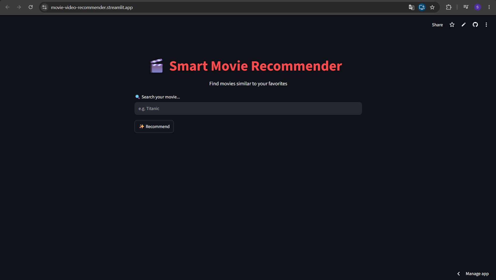

# Movie Recommender System 🎬

A content-based movie recommendation system built using Machine Learning and NLP techniques.

## Features
- Recommends similar movies based on user input
- Uses TF-IDF vectorization
- Cosine similarity for matching
- Fast and lightweight

## Tech Stack
- Python
- Streamlit
- Scikit-learn
- Pandas
- NumPy

## Dataset
TMDB 5000 Movies Dataset

## Installation
```bash
pip install -r requirements.txt
streamlit run app.py
```

## Project Structure
- app.py
- requirements.txt
- dataset files

## Future Improvements
- Better recommendation ranking
- Genre priority enhancement
- UI improvements
## Preview

